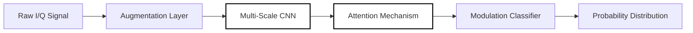

<div align="center">

# Signal Intelligence

**Deep Learning for Signal Modulation Classification and DSP**

[](https://github.com/AsaqeLee/Signal)
[](https://github.com/AsaqeLee/Signal)
[](https://github.com/AsaqeLee/Signal)

English | [简体中文](./README_ZH.md)

</div>

---

## Introduction

**Signal Intelligence** is an advanced framework for automatic modulation classification (AMC) utilizing deep learning. It integrates multi-scale feature fusion and attention mechanisms to identify signal types across challenging channel conditions, including multi-path fading and frequency offsets.

>[!IMPORTANT]
>This project utilizes Squeeze-and-Excitation (SE) blocks and depthwise separable convolutions to maintain high accuracy with minimal computational overhead.

---

## Architecture Flow

The pipeline handles raw signal ingestion through inference.



---

## Technical Specifications

<details>
<summary><b>Model Internal Structure</b></summary>

```text
project/
├── model/
│   ├── modulation_classifier.py  # Core Orchestrator
│   ├── modules.py                # SE Blocks & Depthwise Conv
│   └── base_model.py             # Feature Extraction Backbone
├── data/
│   ├── dataset.py                # High-efficiency Loader
│   └── augmentations.py          # Phase & Frequency Jitter
└── utils/                        # Metrics & Early Stopping
```
</details>

<details>
<summary><b>Hardened Training Strategy</b></summary>

The system employs several advanced techniques to ensure convergence and generalization:
- **Optimizer:** AdamW with weight decay.
- **Scheduler:** Cosine Annealing with Restarts.
- **Regularization:** Label Smoothing and Feature Normalization.
- **Mixed Precision:** FP16 training for accelerated iteration.
</details>

<details>
<summary><b>Installation & Training</b></summary>

### Prerequisites
- Python 3.9+
- CUDA-compatible GPU (recommended)

### Execution
```bash
# Install dependencies
pip install -r requirements.txt

# Start distributed training
python -m project.train
```
</details>

---

## Strategic Capabilities

- **Resilient DSP:** Robust against multi-path effects and frequency drift.
- **Feature Fusion:** Combines global and local features for superior classification.
- **Adaptive Augmentation:** Dynamic signal noise injection during training.

---

<div align="center">

&copy; 2026 AsaqeLee. Built for advanced signal processing research.

</div>
